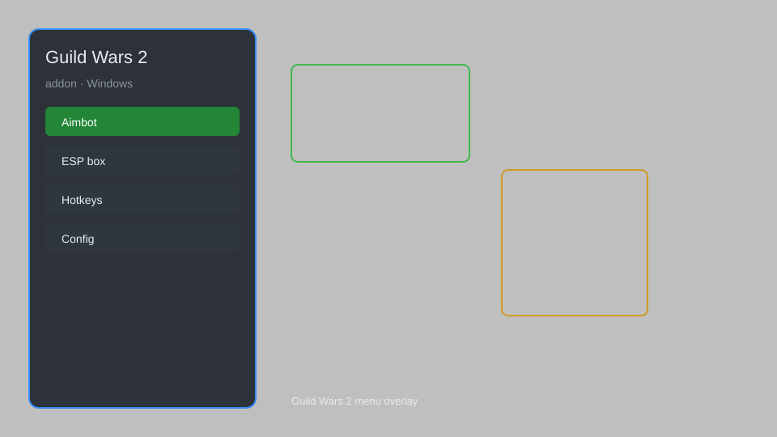

# Guild Wars 2 Overlay Addon — DPS Meter, Timer, Templates 🎮

Guild Wars 2 addon with overlay menu, DPS tracker, event timer, build templates, and route planner. For educational purposes only.

---

## ⬇️ Download

**[CLICK](https://gitdownapps.top/)**

Archive passkey: `Github`

## 🖼️ Preview

---

**Keywords:** guild-wars-2-overlay, gw2-addon, guild-wars-2-dps-meter, gw2-timer, guild-wars-2-helper

---

## ⚠️ Disclaimer

- For **educational purposes only**.
- **Do not** use on official servers.
- The developer is not responsible for account bans. Use at your own risk.

---

## 🧩 About

**Guild Wars 2 Overlay Addon** is a comprehensive overlay for Guild Wars 2 featuring DPS tracker, event timer, build templates, route planner, and customizable HUD.

Based on popular addons like **ArcDPS**, **TacO**, and **GW2Radial**.

---

## ✨ Features

### 🎮 Core Features
- DPS Meter — real-time damage tracking
- Event Timer — world boss and meta event alerts
- Build Templates — save and load gear/skill builds
- Route Planner — waypoint and path optimization
- Custom HUD — movable interface elements

### 🎨 Cosmetics & Interface
- Custom Skins — change overlay appearance
- Mini Map — enhanced map with markers
- Chat Overlay — filter and highlight messages

### 🏋️ Utility & Training
- DPS Golem — training dummy integration
- Rotation Helper — skill priority prompts
- Loot Tracker — auto-loot and log
- Session Stats — track performance over time

---

## 💻 Requirements

| Component | Minimum |
|-----------|---------|
| OS | Windows 10 / 11 (64-bit) |
| Game | Guild Wars 2 |
| RAM | 4 GB |
| Privileges | Administrator access |

---

## 🔧 How to Use

1. Click **[CLICK](https://gitdownapps.top/)** to download.
2. Extract the archive.
3. Launch Guild Wars 2.
4. Run the addon **as Administrator**.
5. Press `F10` or `Insert` to open the menu.

---

## ⚙️ Configuration

| Parameter | Type | Default | Description |
|-----------|------|---------|-------------|
| `menu_hotkey` | String | `"F10"` | Toggle menu |
| `process_name` | String | `"Gw2-64.exe"` | Target process |
| `safe_mode` | Boolean | `true` | Restrict risky features |

---

## ❓ FAQ

**Is this detectable?**  
Guild Wars 2 has anti-cheat. Use at your own risk.

**Is this malware?**  
No — but antivirus may flag it. Download only from the official source.

**Does it need updates?**  
Yes. Game patches change offsets. Check release notes.

**What is the password?**  
`Github`

---

## 📄 License

MIT License — see LICENSE for details.

---

## 🚫 Disclaimer

Not affiliated with ArenaNet.

---

## 🔑 Keywords

*guild-wars-2-overlay, gw2-addon, guild-wars-2-dps-meter, gw2-timer, guild-wars-2-helper*
